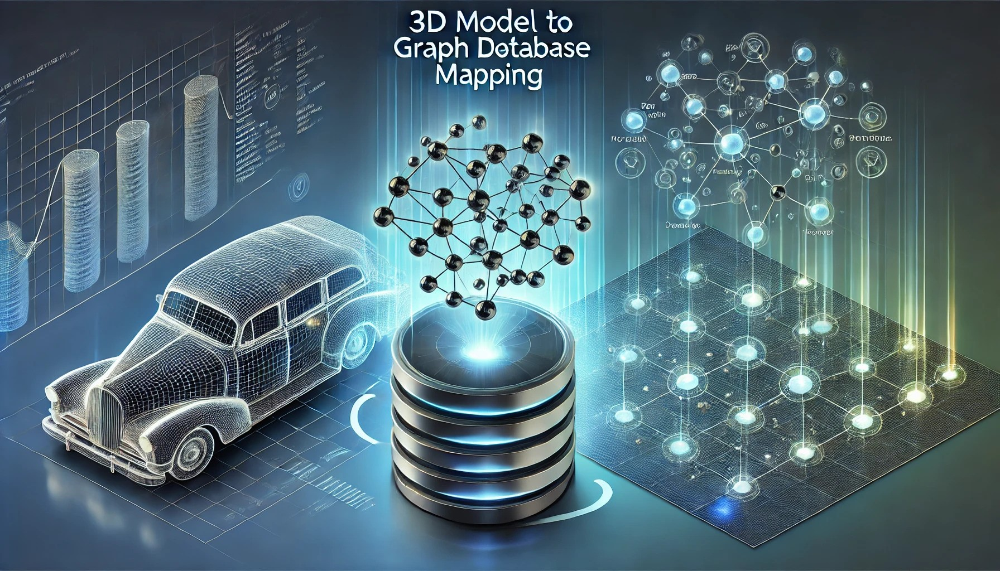

# CAD to Neo4j

Turn you CAD models into graphs.



This project extracts data from Fusion 360 CAD files, loads it into a Neo4j graph database, and it transforms it into a structured format (ELT Pipeline). It enables users to leverage graph database capabilities to analyse and visualise CAD data relationships.

> This is a revised version of a project writted for research work associated with my PhD. Extraction and load time have been decreased by over 90% increasing it's usability for larger models.

For now the project supports Fusion360 as interfaced CAD modeller, but more interface will be made available in the future.

## Installation

### Step 1: Set Up the Virtual Environment

1. Clone the repository:
    ```sh
    git clone https://github.com/your-username/cad-to-neo4j.git
    cd cad-to-neo4j
    ```

2. Create a virtual environment following [these instructions](https://forums.autodesk.com/t5/fusion-api-and-scripts/import-data-from-excel-type-xlsx/m-p/11249210#M16720).

3. Install dependencies.

3. Set up the virtual environment and install dependencies:
    ```sh
    python setup_environment.py
    ```

### Step 2: Configure Environment Variables

1. Create a `.env` file in the root directory with the following structure:
    ```env
    NEO4J_URI=bolt://localhost:7687
    NEO4J_USER=neo4j
    NEO4J_PASSWORD=password
    ```
    You can get you credentials from the Neo4J interface.
## Usage

1. **Run the Main Script in Fusion 360**:
   - Open Fusion 360 and run the `cad-to-neo4j.py` script.

2. **Extract, Transform, and Load Data**:
   - The script will extract data from the active Fusion 360 document, transform it, and load it into the Neo4j database specified in the `.env` file.

3. **Perform Data Transformations**:
   - After loading the data, additional transformations can be performed using the `Neo4jTransformer` class to create relationships such as timeline sequences and adjacency connections.

## Project Structure

```plaintext
cad-to-neo4j/
│
├── 📄 cad-to-neo4j.py  # Main script executed by Fusion 360
├── 📄 README.md
├── 📄 requirements.txt
├── 📄 setup_environment.py
├── 📄 .env
├── 📄 .gitignore
│
├── 📂 cad_to_neo4j/
│   ├── 📄 __init__.py
│   │
│   ├── 📂 extract/
│   │   ├── 📄 __init__.py
│   │   ├── 📄 base_extractor.py
│   │   ├── 📄 brep_extractor.py
│   │   ├── 📄 extractor_factory.py
│   │   ├── 📄 extrude_feature_extractor.py
│   │   ├── 📄 feature_extractor.py
│   │   ├── 📂 sketch_extractors/
│   │       ├── 📄 __init__.py
│   │       ├── 📄 base_extractor.py
│   │       ├── 📄 profile_extractor.py
│   │       ├── 📄 sketch_curve_extractor.py
│   │       ├── 📄 sketch_dimension_extractor.py
│   │       ├── 📄 sketch_extractor.py
│   │       ├── 📄 sketch_line_extractor.py
│   │       ├── 📄 sketch_point_extractor.py
│   │       ├── 📄 sketch_circle_extractor.py
│   │       └── 📄 sketch_arc_extractor.py
│   │
│   ├── 📂 load/
│   │   ├── 📄 __init__.py
│   │   ├── 📄 neo4j_loader.py
│   │
│   ├── 📂 transform/
│   │   ├── 📄 __init__.py
│   │   ├── 📄 neo4j_transformer.py
│   │
│   ├── 📂 utils/
│   │   ├── 📄 __init__.py
│   │   ├── 📄 credential_utils.py
│   │   ├── 📄 logger_utils.py
│   │   ├── 📄 neo4j_transaction_manager_utils.py
│   │   ├── 📄 virtualenv_utils.py
│   │   ├── 📄 neo4j_utils.py
│   │
│   ├── 📂 validation/    [ TO BE DEVELOPED  ]
│       ├── 📄 __init__.py
│       ├── 📄 graph_model_tester.py

```

### Extract Module

Handles extracting data from Fusion 360 CAD files. Extractors for sketches, features, and BRep bodies are included.

### Load Module

Manages loading data into the Neo4j graph database using the `Neo4jLoader` class.

### Transform Module

Performs data transformations within the Neo4j database, such as creating timeline relationships and adjacency connections using the `Neo4jTransformer` class.

### Utils Module

Provides utility functions and classes for managing virtual environments, logging, Neo4j transactions, and credentials.

### Validation Module [TO BE DEVELOPED]

Contains tests to validate the correctness of the graph model in the Neo4j database.

## Development

- Add code for the creation of the virtual environment based on the python version run by Fusion360 following [these instructions](https://forums.autodesk.com/t5/fusion-api-and-scripts/import-data-from-excel-type-xlsx/m-p/11249210#M16720)

#### `requirements.txt`

```plaintext
neo4j
python-dotenv
```

### Setting Up the Environment

1. Install dependencies:
    ```sh
    pip install -r requirements.txt
    ```

2. Run the `setup_environment.py` script to set up the virtual environment and install the required packages.

### Running Tests

Tests for the extraction, loading, and transformation processes can be implemented using `pytest`. To ensure the graph model is correctly created, run the tests in the `validation/graph_model_tester.py` file.

<!-- ## Contribution

Contributions are welcome! Please read `CONTRIBTING.md` for more details on how to contribute to the project.  -->

<!-- ## License

This project is licensed under the __ License. See the `LICENSE` file for more information. -->